# MedSync – Smart Telemedicine Portal & Emergency QR Health Access
## Project Overview & Documentation

MedSync is a next-generation telemedicine portal and emergency healthcare coordination system. It facilitates secure, WebRTC-enabled remote consultations between verified doctors and patients, features a RAG-powered medical AI assistant (Gemini + Pinecone), implements role-based credit-based appointments (Stripe), and provides a life-saving Emergency QR Health Access system.

---

## 🛠️ Tech Stack & Architecture

MedSync is built on a modern, decoupled, and secure cloud architecture using the following technology components:

### 1. Core Framework & Language
*   **Next.js 15 (App Router, Turbopack, Server Actions):** Powering both server-side rendered routes and secure, client-free APIs (Server Actions) for database operations.
*   **React 19 & JavaScript/TypeScript:** High-performance, declarative rendering engine with dynamic, responsive state management.
*   **TailwindCSS & Radix UI (shadcn/ui):** Curated design tokens, dynamic animations, and fully accessible UI components.

### 2. Authentication & Authorization
*   **Clerk (`@clerk/nextjs`):** Production-grade authentication, session management, and custom login/registration flows.
*   **Role-Based Middleware (`middleware.js`):** Ensures route-level validation, separating the admin, doctor, patient, and guest dashboards securely.

### 3. Database & Object Storage
*   **Supabase (PostgreSQL Database):** Standard PostgreSQL backend hosting all relational schemas (Users, Availabilities, Appointments, Chats, Transactions, Payouts, AccessLogs).
*   **Prisma Client & Prisma ORM (`@prisma/client`):** Schema modeling, migration automation, and safe query building.
*   **Database Binary Storage (Base64 Data URLs):** Uploaded paper prescriptions (PDF/images) are converted on-the-fly to Base64 strings and stored directly in the PostgreSQL database. This completely bypasses local write-only filesystem limits of serverless providers like Vercel.

### 4. Live Consultation (Video & Audio)
*   **Vonage Video API (formerly OpenTok) (`@vonage/server-sdk`):** WebRTC infrastructure. Automatically provisions routed video call session IDs on booking and generates secure client tokens with embedded user role metadata.

### 5. Artificial Intelligence & RAG Chatbot
*   **Google Gemini API (`gemini-2.0-flash`):** Main generative model. Programmed with a customized system prompt that enforces symptom triage, a conversational doctor-like flow (asking one clarifying question at a time), and critical safety guardrails.
*   **Pinecone Vector Database (`@pinecone-database/pinecone`):** Vector index (`medical-chatbot`) storage. Used to query medical context vectors using embeddings generated via custom embeddings.
*   **Multi-Model API Fallbacks:** Code architecture contains dynamic adapters to switch engines to OpenAI (`gpt-4o-mini`), Groq (`llama-3.3-70b-versatile`), or OpenRouter (`meta-llama/llama-3-8b-instruct:free`) if API keys are supplied in the `.env` file.

### 6. Payments & Wallet System
*   **Stripe (`stripe`):** Payments provider. Initiates checkout sessions for purchasing internal credits and intercepts webhook transactions (`stripe-webhook`) for real-time wallet balance updates.

### 7. QR Scanner & Offline Access
*   **html5-qrcode:** A client-side camera scanner library enabling doctors or bystanders to read patient emergency health QR codes.
*   **qrcode:** Server-side generator to render unique, cryptographic patient QR tokens.

---

## 🗂️ Project Directory Structure

```filepath
Tech-Champions-HackNovate-2025-main/
├── actions/                  # Next.js Server Actions (Database & Server Side APIs)
│   ├── admin.js              # Admin features (doctor verification, credits management, payouts)
│   ├── appointments.js       # Appointment booking, slots generation, Vonage WebRTC tokens
│   ├── credits.js            # User credit balance changes, Stripe webhook deductions
│   ├── doctor.js             # Doctor specific operations (notes, availabilities, profile updates)
│   ├── doctors-listing.js    # Filtered lists of verified doctors
│   ├── onboarding.js         # Role onboarding forms (Patient details/Doctor credentials)
│   ├── patient.js            # Patient profile updates
│   └── payout.js             # Doctor payout requests (exchanging credits to real money)
├── app/                      # Next.js 15 App Router Folder
│   ├── (auth)/               # Clerk Authentication Layouts & Pages
│   ├── (main)/               # Authenticated Main App Router
│   │   ├── admin/            # Admin Panel UI (verifying doctors, reviewing payout ledger)
│   │   ├── ai-assistant/     # RAG Medical Chatbot UI
│   │   ├── appointments/     # Scheduled & Completed Appointments list
│   │   ├── doctor/           # Doctor Portal (manage slots, patient history audits)
│   │   ├── doctors/          # Patient Portal (browse specialties, book verified slots)
│   │   ├── health-card/      # Digital Health Card, vital details, and personal QR Code
│   │   ├── onboarding/       # Post-login onboarding forms for role assignment
│   │   ├── pricing/          # Buy Credits screen (Stripe integrations)
│   │   ├── qr-access/        # QR Code Camera Scanner (Doctor scan, Emergency scan)
│   │   ├── temp-records/     # Time-sensitive Patient Records viewer (Access Token based)
│   │   └── video-call/       # Live Vonage WebRTC consultation interface
│   ├── api/                  # API Endpoint Handlers
│   │   ├── access-request/   # Requesting & approving patient profile access
│   │   ├── chat/             # Chat Assistant API (Gemini + Pinecone query RAG pipeline)
│   │   ├── qr/               # Scan validation, Emergency bypass endpoints
│   │   ├── temp-access/      # Time-limited session validator
│   │   ├── upload/           # File upload API (converts file to Base64 and updates Database)
│   │   └── webhook/          # Stripe webhooks for wallet upgrades
│   ├── favicon.ico
│   ├── globals.css           # Global styles and tailwind directives
│   ├── layout.js             # Core App provider layout (Clerk, Theme)
│   └── page.js               # Landing page / Hero section
├── components/               # Reusable React UI Components
│   ├── ui/                   # shadcn core base primitives
│   ├── ai-chat.jsx           # AI Assistant chat window wrapper
│   ├── appointment-card.jsx  # Individual appointment list card
│   ├── header-client.jsx     # Navigation bar client components
│   ├── header.jsx            # Server-rendered layout header
│   ├── page-header.jsx       # Section banner text headers
│   ├── theme-provider.jsx    # Dark/Light color theme contextual wrapper
│   └── PatientQRCard.jsx     # Printable Emergency QR Card Component
├── hooks/                    # Reusable React hooks
├── lib/                      # Shared helper utilities & DB initializers
│   ├── checkUser.js          # Clerk-to-Prisma user sync utility
│   ├── data.js               # Mock templates and placeholders
│   ├── embeddings.js         # Embeddings generation connector
│   ├── pinecone.js           # Pinecone vector search initialization
│   ├── prisma.js             # Prisma client singleton constructor
│   ├── qr.js                 # QR code render helpers
│   ├── schema.js             # Zod input validations
│   ├── specialities.js       # Medical specialties list metadata
│   ├── stripe.ts             # Stripe API client initializer
│   └── utils.js              # CSS merging utilities
├── prisma/                   # Prisma Configuration Folder
│   ├── migrations/           # Generated SQL migration history
│   └── schema.prisma         # Database schema (PostgreSQL)
├── public/                   # Static resources
│   ├── uploads/              # (Deprecated / Local fallback folder)
│   ├── banner.webp
│   └── logo-single.png
├── .env                      # Application Environment Configurations
├── package.json              # Script commands and dependencies
└── middleware.js             # Clerk security gateway
```

---

## 🔄 End-to-End System Flows

```mermaid
sequenceDiagram
    autonumber
    actor Patient
    actor Doctor
    participant MedSyncApp as MedSync Portal
    participant Clerk as Clerk Auth
    participant Vonage as Vonage Video API
    participant Stripe as Stripe SDK
    participant Gemini as Gemini AI + Pinecone
    participant DB as Supabase PostgreSQL

    %% Registration & Onboarding
    Note over Patient, Clerk: Registration & Onboarding
    Patient->>Clerk: Sign Up / Sign In
    Clerk-->>Patient: Auth Token
    Patient->>MedSyncApp: Complete Onboarding (Health info + vitals)
    MedSyncApp->>DB: Save User (Create unique QR Token)

    %% Credit Purchase
    Note over Patient, Stripe: Wallet Recharge (Stripe)
    Patient->>MedSyncApp: Buy Credits
    MedSyncApp->>Stripe: Create Checkout Session
    Stripe-->>Patient: Stripe Checkout Page
    Stripe->>MedSyncApp: Webhook notification (success)
    MedSyncApp->>DB: Increment Patient Credits Balance

    %% Appointment Booking
    Note over Patient, Doctor: Slot Booking (Cost: 500 Credits)
    Patient->>MedSyncApp: Select Doctor & Available Slot
    MedSyncApp->>DB: Check Overlaps & Verify Credits
    MedSyncApp->>Vonage: Create Video Session ID
    MedSyncApp->>DB: Deduct 500 Credits (Transfer to Doctor)
    MedSyncApp->>DB: Insert Appointment (Status: SCHEDULED)

    %% Live Consultation & Real-time prescription sync
    Note over Patient, Doctor: Live Consultation
    Doctor->>MedSyncApp: Start Call (At scheduled time)
    Patient->>MedSyncApp: Join Call
    MedSyncApp->>Vonage: Request Publish/Subscribe Tokens
    Vonage-->>MedSyncApp: Connected (WebRTC Video Room)
    
    rect rgb(20, 40, 20)
        Note right of Doctor: Real-Time Prescription Sync
        Doctor->>MedSyncApp: Write Prescription Notes
        MedSyncApp->>DB: Update Appointment Notes (in database)
        Note left of Patient: Auto-polls DB every 5s
        MedSyncApp->>DB: Fetch Notes / Files
        DB-->>MedSyncApp: Live Prescription Content
        MedSyncApp-->>Patient: Render live prescription
    end

    Doctor->>MedSyncApp: End Consultation Call
    MedSyncApp->>DB: Update status to COMPLETED
```



### 1. Role-Based Onboarding Flow
*   **Authentication Check:** Users authenticate through Clerk.
*   **Schema Synchronization (`lib/checkUser.js`):** On loading, Clerk User details sync into the Supabase database. If the user doesn't exist, a new database record is initialized.
*   **Role Setup (`actions/onboarding.js`):**
    *   **Patient Role:** Users fill in age, gender, address, food habits, vitals (systolic/diastolic blood pressure, fasting/postprandial sugar), surgeries, blood group, and emergency contacts. The server generates a unique cryptographic `qrToken` (32-character hexadecimal) and saves it to the patient.
    *   **Doctor Role:** Users provide their medical specialty, experience level, credentials verification URL, and a brief description. Under development, the role auto-verifies to status `VERIFIED` immediately.

### 2. Credit Wallet & Appointment Booking
*   **Credit Wallet System:** Each user has a `credits` field in the database. Booking an appointment costs **500 credits**.
*   **Stripe Payments Integration (`actions/credits.js`):** Users purchase credits via Stripe. The Stripe checkout redirects back to `/pricing` on completion. The background API webhook endpoint processes checkout sessions, matches the target Clerk user, and increments the database balance.
*   **Appointment Reservation (`actions/appointments.js`):**
    1.  Validates that the patient has $\ge 500$ credits.
    2.  Checks for overlapping appointments for the selected doctor.
    3.  Calls the **Vonage Video API SDK** (`vonage.video.createSession`) to construct a secure WebRTC media session ID.
    4.  Runs a database transaction using Prisma: deducts 500 credits from the patient, credits the doctor, and inserts the appointment with status `SCHEDULED` containing the `videoSessionId`.

### 3. Live Video Consultation & Live Sync
*   **WebRTC Video Room (`app/(main)/video-call/video-call-ui.jsx`):**
    *   Once the consultation starts, the app injects the Vonage Client JavaScript SDK (`opentok.js`).
    *   It requests a client token from the backend, containing embedded connection data (User ID, Name, and Role: Doctor/Patient).
    *   Initializes the session and publisher streams (handling micro/camera state toggles client-side).
*   **Live Prescription & Diagnostics Synchronization:**
    *   **Doctor View:** Features a Patient File panel listing vitals, blood groups, and medical history. Below is a text editor to draft diagnostics/prescriptions. Clicking "Save & Send" executes a server action updating the appointment `notes`.
    *   **Patient View:** Displays a live viewer. It utilizes a polling timer running every 5 seconds to query `getAppointmentParticipants(appointmentId)`. When the doctor updates notes, they immediately render on the patient's screen in real-time.
    *   **Attachment Uploads:** Doctors can upload external files (images, PDFs) which hit `/api/upload` (converts files to Base64 Data URLs, saves them directly in the database `prescriptionUrl` field, and renders them instantly on the client).

### 4. Emergency QR Health Access System
This system acts as a life-saving portal for patients who may be unresponsive in emergency situations. The access path depends on who scans the QR code:

#### Path A: Verified Doctor Scan (Immediate EHR Retrieval)
1.  A doctor scans the patient's QR code using the scanner at `/qr-access`.
2.  The scanner decodes the QR token and requests `/api/qr/[token]`.
3.  The API verifies the scanner is a logged-in user with role `DOCTOR` and status `VERIFIED`.
4.  It immediately outputs the patient's entire medical record (history, allergies, BP, sugar, past appointments, prescription links).
5.  It inserts an audit record with access type `DIRECT_DOCTOR_ACCESS` into the database access logs for patient privacy compliance.

#### Path B: Bystander / Public Scan (Emergency Bypass Information)
1.  A non-doctor (e.g., bystander, family, first responder) scans the QR code.
2.  The scanner is redirected to the public emergency endpoint `/api/qr/emergency/[token]`.
3.  If the patient enabled emergency access, the portal exposes only critical, lifesaving bypass information:
    *   **Name & Age**
    *   **Blood Group**
    *   **Allergies**
    *   **Emergency Contact Name and Phone**
4.  It immediately writes an audit record with access type `EMERGENCY_ACCESS` to the logs.

#### Path C: External Request / Temporary Access Token (15-Min Expiry)
1.  If the scanner is not a doctor and requires complete records, they submit a request (name, phone, reason) targeting `/api/access-request`.
2.  A `PENDING` request is logged in the DB.
3.  On the patient dashboard, the patient sees the request. Clicking `APPROVE` calls the approve API, which:
    *   Updates the request status to `APPROVED`.
    *   Generates a cryptographically secure 15-minute `accessToken`.
4.  The external requester receives the token and can view the record at `/temp-records/[accessToken]`. After 15 minutes, access is revoked.

---

## 🤖 RAG AI Assistant Integration
*   **The Problem:** Standard LLMs lack specialized, real-time medical facts, context, or patient-specific history.
*   **The RAG Pipeline:**
    1.  The patient types a symptom (e.g., *"I have chest tightness and a rash"*).
    2.  The input text hits `/api/chat/route.js`.
    3.  The text is vectorized using an embedding model (`lib/embeddings.js`).
    4.  The vector is queried against the Pinecone `medical-chatbot` index, returning the top 3 most relevant medical reference contexts (`lib/pinecone.js`).
    5.  The system pulls the patient's current vitals, allergies, food habits, and medical history from Supabase.
    6.  It creates a detailed compound system prompt combining:
        *   **Context:** Pinecone medical articles.
        *   **User Dossier:** Vitals, BP, sugar levels, allergies, surgeries.
        *   **Instructions:** Triage symptoms, act like a doctor, ask **only one clarifying question at a time**, and wait for the user to answer.
        *   **Critical Safety Guardrail:** If symptoms indicate an emergency, it immediately flags this and instructs the patient to book a verified consultation or call emergency services.
    7.  It requests text completion from Google Gemini (`gemini-2.0-flash`), falling back to OpenAI or Groq if configured.
    8.  Saves the chat session and messages in PostgreSQL database.

---

#

## 🚀 Deployment Guide

To deploy MedSync to production:

### 1. Database Setup (Supabase)
1.  Create a Supabase Project.
2.  Navigate to Project Settings -> Database -> Connection String (URI).
3.  Set the connection string as `DATABASE_URL` in `.env`.
4.  Run Prisma migrations to build the tables:
    ```bash
    npx prisma migrate deploy
    npx prisma generate
    ```

### 2. Authentication Setup (Clerk)
1.  Create an application in Clerk.
2.  Obtain the publishable and secret keys.
3.  Configure Clerk middleware redirects in the Clerk Dashboard.

### 3. Video API Setup (Vonage)
1.  Create a Vonage Developer account.
2.  Create a Video Application inside the dashboard.
3.  Obtain the Application ID (`NEXT_PUBLIC_VONAGE_APPLICATION_ID`).
4.  Generate and download the Private Key PEM file, set its contents as `VONAGE_PRIVATE_KEY` (use literal newlines `\n` in environment configuration).

### 4. Vector DB Setup (Pinecone)
1.  Create a Pinecone account.
2.  Initialize an index named `medical-chatbot` (dimension matching the embedding model, e.g., 384 or 1536).
3.  Populate medical knowledge documents using embeddings.
4.  Add the API key to `PINECONE_API_KEY` and the index name to `PINECONE_INDEX`.

### 5. Hosting (Vercel)
1.  Import the repository to Vercel.
2.  Define all required variables in Environment Variables settings.
3.  Set the Build Command to `npm run build` and install dependencies.
4.  Deploy. Vercel automatically deploys the serverless route handlers and handles the App Router.
